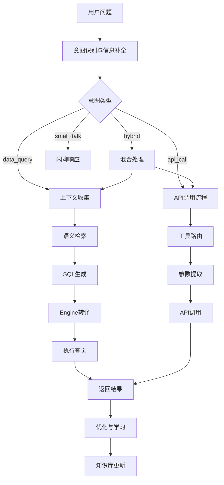
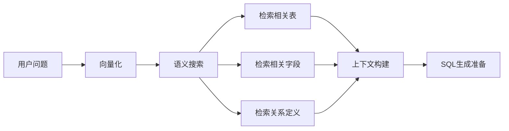
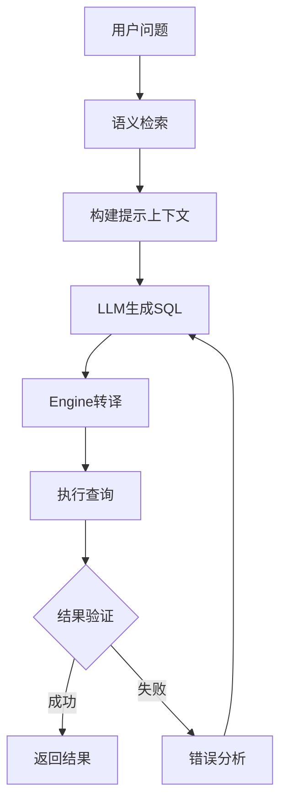
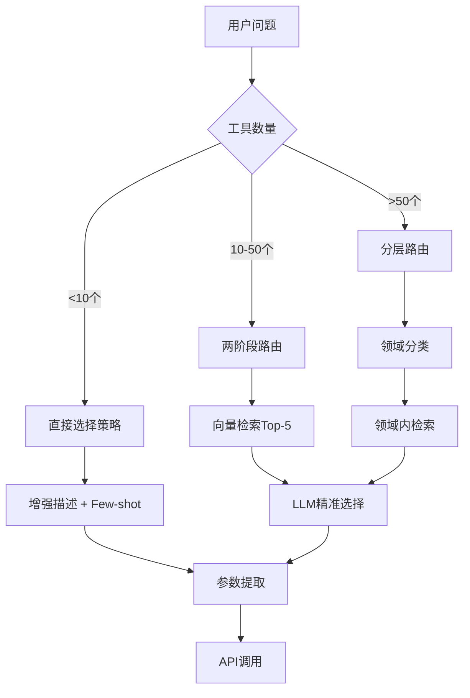
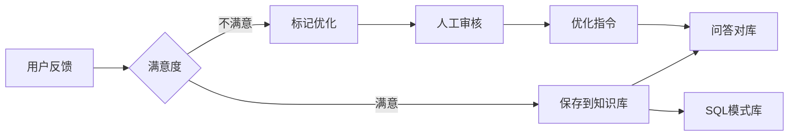

# 智能问数系统说明

## 一、系统整体架构



## 二、智能问数的六个核心阶段

### 阶段 1: 意图识别与信息补全

**目标：准确判断用户问题类型，确保必要信息完整**

#### 1.1 意图识别

**意图分类标准：**

| 意图类型 | 识别特征 | 示例问题 |
| --- | --- | --- |
| small\_talk | 问候、感谢、闲聊 | "你好"、"谢谢"、"今天天气如何" |
| data\_query | 统计、聚合、趋势分析 | "坪山街道办事处这个月处理了多少案件"、"暴露垃圾事件的主要来源" |
| api\_call | 查询特定记录、执行业务操作 | "查询事件 PS20240101 的处理进度"、"获取坪山街道办的详细信息" |
| hybrid | 需要多步处理 | "对比各街道上月案件数并查询处理最快的案件详情" |

**意图识别实现方式：**

```python
# 基于 LLM 的意图分类
system_prompt = """
你是一个意图分类专家。请判断用户问题的意图类型:
- small_talk: 问候、感谢、闲聊等非业务问题
- data_query: 需要查询数据库进行统计分析（如统计案件数量、分析事件类型分布）
- api_call: 需要调用业务API获取特定信息或执行操作（如查询具体事件详情、更新处理状态）
- hybrid: 需要多步处理的复杂问题（如先统计再查询详情）

输出JSON格式: {"intent": "类型", "confidence": 0.95, "reason": "判断理由"}
"""

```

#### 1.2 信息完整性检查

**问题模板配置示例（坪山业务场景）：**

```json
{
  "template_id": "event_detail_query",
  "intent": "api_call",
  "patterns": [
    "查询事件.*详情",
    ".*事件.*处理状态",
    "事件.*进展"
  ],
  "required_params": [
    {
      "name": "event_id",
      "type": "string",
      "description": "事件编号",
      "validation": "^[A-Z0-9]{10,20}$",
      "guide_question": "请提供事件编号（例如: PS20250304001）",
      "extraction_hints": ["事件号", "编号", "ID"]
    }
  ],
  "optional_params": [
    {
      "name": "detail_level",
      "type": "enum",
      "values": ["simple", "detailed"],
      "default": "simple"
    }
  ],
  "api_mapping": "event_api.query_event_status"
}

```

**引导对话示例：**

```plaintext
用户: "查询暴露垃圾事件的处理进度"
系统: "请提供事件编号，例如: PS20250304001"

用户: "PS20250304001"
系统: [验证通过] → 调用事件查询API

```

### 阶段 2: 上下文收集

**目标：建立完整的数据语义层，让 LLM 理解业务上下文**

#### 2.1 连接数据源

**支持的数据库类型：**

*   PostgreSQL、MySQL、Oracle、达梦等
    

**坪山项目数据源示例：**

*   主数据库：pingshan\_stat\_info（事件统计表）
    
*   关联表：街道信息表、事件类型字典表、处理单位表
    

#### 2.2 构建语义模型（MDL）

**a) 数据模型（Models）**

```json
{
  "name": "pingshan_stat_info",
  "columns": [
    {
      "name": "EVENT_SRC_NAME",
      "type": "VARCHAR",
      "properties": {
        "description": "事件来源名称，标识事件的上报渠道",
        "displayName": "事件来源"
      }
    },
    {
      "name": "first_unit_name",
      "type": "VARCHAR",
      "properties": {
        "description": "首次处理单位名称，如'坪山街道办事处'",
        "displayName": "处理单位"
      }
    },
    {
      "name": "SUB_TYPE_NAME",
      "type": "VARCHAR",
      "properties": {
        "description": "事件子类型名称，如'暴露垃圾'",
        "displayName": "事件类型"
      }
    },
    {
      "name": "CREATE_TIME",
      "type": "TIMESTAMP",
      "properties": {
        "description": "事件创建时间",
        "displayName": "创建时间"
      }
    },
    {
      "name": "EVENT_DESC",
      "type": "TEXT",
      "properties": {
        "description": "事件描述详情",
        "displayName": "事件描述"
      }
    }
  ],
  "primaryKey": "EVENT_ID",
  "properties": {
    "description": "坪山区事件统计信息表，包含所有上报事件的详细信息"
  }
}

```

**b) 关系定义（Relationships）**

```json
{
  "name": "EventToUnit",
  "models": ["pingshan_stat_info", "unit_info"],
  "joinType": "ONE_TO_MANY",
  "condition": "pingshan_stat_info.first_unit_name = unit_info.unit_name"
}

```

**c) 计算字段（Calculated Fields）**

```json
{
  "name": "is_garbage_event",
  "type": "BOOLEAN",
  "isCalculated": true,
  "expression": "SUB_TYPE_NAME LIKE '%垃圾%' OR THIRD_TYPE_NAME LIKE '%垃圾%' OR MAX_EVENT_TYPE_NAME LIKE '%垃圾%' OR EVENT_DESC LIKE '%垃圾%'"
}

```

**d) 宏函数（Macro Functions）**

```json
{
  "name": "currentMonthFilter",
  "definition": "(date_field: Expression) => date_field >= DATE_FORMAT(CURDATE(), '%Y-%m-01') AND date_field < DATE_FORMAT(DATE_ADD(CURDATE(), INTERVAL 1 MONTH), '%Y-%m-01')"
}

```

### 阶段 3: 检索优化（Retrieval）

**目标：从语义模型中精准检索相关的表、字段和关系**



#### 3.1 语义搜索

**示例：用户问题"暴露垃圾事件的主要来源是什么？"**

检索结果：

*   相关表：`pingshan_stat_info`
    
*   相关字段：`EVENT_SRC_NAME`（事件来源）、`SUB_TYPE_NAME`（事件类型）
    
*   相关过滤条件：垃圾相关的多字段匹配
    

#### 3.2 上下文关联

*   引入计算字段：`is_garbage_event`
    
*   关联知识库：已保存的类似查询模式
    
*   应用全局指令：数据过滤规则
    

### 阶段 4: SQL 生成（SQL Generation）

**目标：基于语义上下文生成准确可执行的 SQL 查询**

#### 4.1 SQL 生成流程



#### 4.2 实际案例分析

**案例 1：统计查询**

用户问题：

```plaintext
"暴露垃圾事件的主要来源是什么？"

```

生成的SQL：

```sql
SELECT 
    EVENT_SRC_NAME AS 事件来源, 
    COUNT(*) AS 数量 
FROM pingshan_stat_info 
WHERE 
    SUB_TYPE_NAME LIKE '%暴露垃圾%' 
    OR THIRD_TYPE_NAME LIKE '%暴露垃圾%' 
    OR MAX_EVENT_TYPE_NAME LIKE '%暴露垃圾%'  
    OR EVENT_DESC LIKE '%暴露垃圾%' 
GROUP BY EVENT_SRC_NAME 
ORDER BY 数量 DESC;

```

**案例 2：时间范围查询**

用户问题：

```plaintext
"这个月坪山街道办事处处理了多少案件"

```

生成的SQL：

```sql
SELECT COUNT(*) AS 案件数量
FROM pingshan_stat_info
WHERE 
    CREATE_TIME >= DATE_FORMAT(CURDATE(), '%Y-%m-01')
    AND CREATE_TIME < DATE_FORMAT(DATE_ADD(CURDATE(), INTERVAL 1 MONTH), '%Y-%m-01')
    AND first_unit_name = '坪山街道办事处';

```

**案例 3：关键词搜索**

用户问题：

```plaintext
"查询包含'垃圾'关键词的所有事件详情？"

```

生成的SQL：

```sql
SELECT * 
FROM pingshan_stat_info 
WHERE 
    MAX_EVENT_TYPE_NAME LIKE '%垃圾%' 
    OR EVENT_DESC LIKE '%垃圾%';

```

#### 4.3 Engine 的作用

**运行时 SQL 重写示例：**

```sql
-- 用户输入的简单查询
SELECT * FROM pingshan_stat_info WHERE event_type = '垃圾处理'

-- Wren Engine 重写后
WITH event_summary AS (
    SELECT 
        e.*,
        u.unit_full_name,
        t.type_description
    FROM pingshan_stat_info e
    LEFT JOIN unit_info u ON e.first_unit_name = u.unit_name
    LEFT JOIN event_types t ON e.SUB_TYPE_NAME = t.type_name
    WHERE e.SUB_TYPE_NAME = '垃圾处理'
)
SELECT * FROM event_summary

```

#### 4.4 知识库增强

**a) 问答对（Question-SQL Pairs）**

```json
{
  "question": "统计各类型事件的数量",
  "sql": "SELECT SUB_TYPE_NAME AS 事件类型, COUNT(*) AS 事件数量 FROM pingshan_stat_info WHERE SUB_TYPE_NAME <> '' AND SUB_TYPE_NAME IS NOT NULL GROUP BY SUB_TYPE_NAME ORDER BY 事件数量 DESC",
  "description": "按事件子类型分组统计，排除空值，按数量降序",
  "tags": ["统计", "分组", "排序"]
}

```

**b) 全局指令（Global Instructions）**

```plaintext
- 所有数值统计结果四舍五入到整数
- 时间范围查询默认使用 CREATE_TIME 字段
- 排除 first_unit_name 为空的记录（除非明确要求统计未分配案件）
- 对于"最近"的定义默认为最近7天
- 对于"本月"的查询使用当前月份的第一天到下月第一天的时间范围

```

**c) 问题匹配指令（Question-Matching Instructions）**

```json
{
  "pattern": ".*垃圾.*",
  "instruction": "查询垃圾相关事件时，需要同时搜索 SUB_TYPE_NAME、THIRD_TYPE_NAME、MAX_EVENT_TYPE_NAME 和 EVENT_DESC 四个字段",
  "example_sql": "WHERE SUB_TYPE_NAME LIKE '%垃圾%' OR THIRD_TYPE_NAME LIKE '%垃圾%' OR MAX_EVENT_TYPE_NAME LIKE '%垃圾%' OR EVENT_DESC LIKE '%垃圾%'"
}

```

### 阶段 5: API 调用流程

**目标：准确路由到正确的 API，提取参数并执行调用**

#### 5.1 工具路由优化策略

**问题场景：** 当系统集成 50+ 个 API 工具时，直接让 LLM 从所有工具中选择会导致：

*   Token 消耗过大
    
*   选择准确率下降
    
*   响应时间过长
    

**解决方案：分层路由架构**



**策略 1: 优化工具描述（适用于少量工具）**

**优化前的工具描述 ❌**

```json
{
  "name": "query_event",
  "description": "查询事件信息",
  "parameters": {
    "event_id": {
      "type": "string",
      "description": "事件ID"
    }
  }
}

```

**优化后的工具描述 ✅**

```json
{
  "name": "query_event_detail",
  "description": "查询事件的完整详细信息，包括事件状态、类型、处理单位、创建时间、事件描述等。\n\n适用场景:\n- 用户询问'事件详情'\n- 用户询问'事件XX的状态'\n- 用户询问'事件XX的处理进度'\n\n不适用场景:\n- 查询事件列表（请使用 query_event_list）\n- 统计事件数量（请使用 data_query 类型查询）\n- 修改事件（请使用 update_event）",
  "parameters": {
    "event_id": {
      "type": "string",
      "description": "事件编号，格式为 PS+8位日期+3位流水号。\n示例: PS20250304001\n提取提示: 从用户输入中寻找以'PS'开头后跟11位数字的字符串",
      "pattern": "^PS\d{11}$",
      "examples": ["PS20250304001", "PS20250115088", "PS20250201123"]
    }
  },
  "response_description": "返回包含事件完整信息的对象，包括 event_id, status, type, unit, create_time, description 等字段",
  "error_cases": {
    "404": "事件不存在，可能是事件号输入错误",
    "403": "无权限访问该事件"
  }
}

```

**策略 2: 两阶段路由（10-50个工具）**

```python
# 第一阶段: 向量检索
def vector_retrieval(user_query, tool_descriptions):
    """
    将用户问题和工具描述转为向量，检索最相关的 Top-5 工具
    """
    query_embedding = embed(user_query)
    tool_embeddings = [embed(tool.description) for tool in tools]
    scores = cosine_similarity(query_embedding, tool_embeddings)
    return top_k(tools, scores, k=5)

# 第二阶段: LLM 精准选择
def llm_selection(user_query, candidate_tools):
    """
    从候选工具中让 LLM 选择最合适的 1-2 个
    """
    prompt = f"""
    用户问题: {user_query}
    
    候选工具:
    {format_tools(candidate_tools)}
    
    请选择最合适的工具并说明理由。
    """
    return llm.call(prompt)

```

**策略 3: 分层路由（50+个工具）**

**领域分类器配置：**

```json
{
  "domains": [
    {
      "name": "event_domain",
      "keywords": ["事件", "案件", "上报", "处理"],
      "patterns": ["事件.*", ".*案件.*", ".*处理.*"],
      "tools_count": 15,
      "description": "处理事件生命周期相关的所有操作"
    },
    {
      "name": "statistics_domain",
      "keywords": ["统计", "分析", "趋势", "对比"],
      "patterns": [".*统计.*", ".*分析.*", ".*对比.*"],
      "tools_count": 10,
      "description": "处理数据统计分析相关的查询"
    },
    {
      "name": "unit_domain",
      "keywords": ["单位", "街道", "部门", "组织"],
      "patterns": [".*单位.*", ".*街道.*", ".*部门.*"],
      "tools_count": 8,
      "description": "处理组织单位相关的查询和操作"
    }
  ]
}

```

#### 5.2 MCP 服务器集成方案

MCP与API工具调用类似，采用分层路由架构，针对不同数量的MCP服务采用不同的策略。

### 阶段 6: 优化与学习

**目标：持续积累知识，提升查询准确性**



#### 6.1 知识管理

**保存成功查询：**

*   用户对查询结果满意时，点击"保存到知识库"
    
*   系统记录问题-SQL 对，供未来复用
    

**主动添加知识：**

*   预先定义常见指标和问题
    
*   优化现有查询
    
*   统一业务术语
    

**管理知识：**

*   查看、编辑、删除问答对
    
*   管理全局指令和问题匹配指令
    

## 三、业务部门数据准备要求

### 3.1 项目数据准备要求

为确保智能问数系统能够准确理解和查询业务数据，业务部门需要提供以下数据准备：

#### 3.1.1 数据库表结构信息

**必需信息：**

1.  **表名和中文说明**
    
    ```plaintext
    表名: pingshan_stat_info
    中文名: 坪山区事件统计信息表
    用途: 记录所有上报事件的详细信息和处理状态
    
    ```
    
2.  **字段清单及语义说明**
    
    | 字段名 | 数据类型 | 中文名称 | 业务含义 | 示例值 |
    | --- | --- | --- | --- | --- |
    | EVENT\_ID | VARCHAR(20) | 事件编号 | 唯一标识事件的编号 | PS20250304001 |
    | EVENT\_SRC\_NAME | VARCHAR(50) | 事件来源 | 事件的上报渠道或来源系统 | 12345热线 |
    | first\_unit\_name | VARCHAR(100) | 处理单位 | 首次负责处理该事件的单位名称 | 坪山街道办事处 |
    | SUB\_TYPE\_NAME | VARCHAR(50) | 事件子类型 | 事件的具体分类 | 暴露垃圾 |
    | CREATE\_TIME | TIMESTAMP | 创建时间 | 事件在系统中的创建时间 | 2025-03-04 14:30:00 |
    | EVENT\_DESC | TEXT | 事件描述 | 事件的详细描述信息 | 小区门口垃圾堆积... |
    
3.  **主键和索引信息**
    

```plaintext
主键: EVENT_ID
常用查询索引: CREATE_TIME, first_unit_name, SUB_TYPE_NAME

```

#### 3.1.2 业务术语词典

**示例：坪山项目术语词典**

| 业务术语 | 标准表达 | 同义词 | 对应字段 | 说明 |
| --- | --- | --- | --- | --- |
| 处理单位 | first\_unit\_name | 负责单位、责任单位、处理部门 | first\_unit\_name | 首次处理该事件的单位 |
| 事件类型 | SUB\_TYPE\_NAME | 案件类型、问题类型、事件分类 | SUB\_TYPE\_NAME | 事件的子类型分类 |
| 垃圾事件 | 垃圾相关事件 | 暴露垃圾、垃圾堆积、垃圾清理 | 多字段模糊匹配 | 需匹配多个字段 |
| 本月 | 当前自然月 | 这个月、当月 | CREATE\_TIME | 从本月1日到下月1日 |
| 最近 | 最近7天 | 近期、最近几天 | CREATE\_TIME | 默认7天内 |

#### 3.1.3 常见业务问题模板

**示例：基于实际业务的问题模板**

```json
[
  {
    "question_pattern": ".*街道.*处理.*多少.*案件",
    "sql_template": "SELECT COUNT(*) FROM pingshan_stat_info WHERE first_unit_name LIKE '%{unit_name}%' AND {time_filter}",
    "required_params": ["unit_name"],
    "optional_params": ["time_filter"],
    "example": "这个月坪山街道办事处处理了多少案件"
  },
  {
    "question_pattern": ".*事件.*主要来源",
    "sql_template": "SELECT EVENT_SRC_NAME, COUNT(*) FROM pingshan_stat_info WHERE {event_filter} GROUP BY EVENT_SRC_NAME ORDER BY COUNT(*) DESC",
    "required_params": ["event_filter"],
    "example": "暴露垃圾事件的主要来源是什么"
  },
  {
    "question_pattern": "统计.*事件.*数量",
    "sql_template": "SELECT SUB_TYPE_NAME, COUNT(*) FROM pingshan_stat_info WHERE SUB_TYPE_NAME IS NOT NULL GROUP BY SUB_TYPE_NAME ORDER BY COUNT(*) DESC",
    "required_params": [],
    "example": "统计各类型事件的数量"
  }
]

```

#### 3.1.4 数据质量要求

**必须满足的数据质量标准：**

1.  **字段完整性**
    
    *   核心字段（如事件编号、创建时间）不能为空
        
    *   分类字段（如事件类型）应尽量完整
        
    
    **检查示例：**
    
    ```sql
    -- 检查未指定处理单位的事件数量
    SELECT COUNT(*) FROM pingshan_stat_info WHERE first_unit_name IS NULL;
    
    -- 检查事件类型为空的记录
    SELECT COUNT(*) FROM pingshan_stat_info WHERE SUB_TYPE_NAME IS NULL OR SUB_TYPE_NAME = '';
    
    ```
    
2.  **数据一致性**
    
    *   同一概念的命名统一（如"坪山街道办事处"不应有多种写法）
        
    *   时间格式统一
        
    *   编码规则一致
        
3.  **数据时效性**
    
    *   历史数据完整性（至少保留1年以上数据用于同比分析）
        
    *   实时数据更新频率（建议每小时同步一次）
        

### 3.2 API 接口数据准备要求

#### 3.2.1 API 接口清单

**必需信息：**

**1. API 基本信息**

```json
{
  "api_name": "query_event_detail",
  "display_name": "查询事件详情",
  "description": "根据事件编号查询事件的完整详细信息，包括事件状态、处理单位、创建时间、事件描述、处理历史等",
  "endpoint": "/api/v1/events/{event_id}",
  "method": "GET",
  "auth_required": true,
  "timeout": 5000,
  "retry_count": 3
}

```

**2. API 参数说明**

**输入参数：**

```json
{
  "parameters": [
    {
      "name": "event_id",
      "type": "string",
      "required": true,
      "description": "事件编号，格式: PS+8位日期+3位流水号",
      "pattern": "^PS\d{11}$",
      "example": "PS20250304001",
      "extraction_guide": "从用户输入中提取以PS开头后跟11位数字的编号，常见表达：'事件号'、'编号'、'ID'",
      "validation_error": "事件编号格式不正确，应为PS开头加11位数字"
    },
    {
      "name": "include_history",
      "type": "boolean",
      "required": false,
      "default": false,
      "description": "是否包含处理历史记录",
      "extraction_guide": "用户提到'历史'、'过程'、'流转记录'时设为true"
    },
    {
      "name": "detail_level",
      "type": "enum",
      "required": false,
      "default": "standard",
      "values": ["simple", "standard", "detailed"],
      "description": "详情级别：simple-基本信息，standard-标准信息，detailed-完整信息",
      "extraction_guide": "用户提到'简单'用simple，'详细'或'完整'用detailed"
    }
  ]
}

```

**输出字段：**

```json
{
  "response_fields": [
    {
      "field": "event_id",
      "type": "string",
      "description": "事件编号",
      "display_name": "事件编号"
    },
    {
      "field": "status",
      "type": "string",
      "description": "当前处理状态",
      "display_name": "状态",
      "enum": ["待分配", "待处理", "处理中", "待验收", "已完成", "已关闭", "已退回"],
      "enum_display": {
        "待分配": "等待分配处理单位",
        "待处理": "已分配，等待处理",
        "处理中": "正在处理",
        "待验收": "处理完成，等待验收",
        "已完成": "已验收通过",
        "已关闭": "已关闭",
        "已退回": "已退回重新处理"
      }
    },
    {
      "field": "sub_type_name",
      "type": "string",
      "description": "事件子类型名称",
      "display_name": "事件类型"
    },
    {
      "field": "event_src_name",
      "type": "string",
      "description": "事件来源渠道",
      "display_name": "事件来源"
    },
    {
      "field": "create_time",
      "type": "timestamp",
      "description": "事件创建时间",
      "display_name": "创建时间",
      "format": "yyyy-MM-dd HH:mm:ss"
    },
    {
      "field": "first_unit_name",
      "type": "string",
      "description": "首次处理单位名称",
      "display_name": "处理单位"
    },
    {
      "field": "current_handler",
      "type": "string",
      "description": "当前处理人",
      "display_name": "处理人"
    },
    {
      "field": "event_desc",
      "type": "text",
      "description": "事件描述详情",
      "display_name": "事件描述"
    },
    {
      "field": "location",
      "type": "string",
      "description": "事件发生地点",
      "display_name": "地点"
    },
    {
      "field": "handle_duration",
      "type": "integer",
      "description": "处理时长（小时）",
      "display_name": "处理时长"
    },
    {
      "field": "process_history",
      "type": "array",
      "description": "处理历史记录",
      "display_name": "处理历史",
      "item_fields": [
        {
          "field": "action_time",
          "type": "timestamp",
          "description": "操作时间"
        },
        {
          "field": "action_type",
          "type": "string",
          "description": "操作类型"
        },
        {
          "field": "operator",
          "type": "string",
          "description": "操作人"
        },
        {
          "field": "remark",
          "type": "string",
          "description": "备注"
        }
      ]
    }
  ]
}

```

**3. 错误码说明**

```json
{
  "error_codes": [
    {
      "code": "404",
      "message": "事件不存在",
      "user_message": "未找到该事件，请检查事件编号是否正确",
      "suggestion": "请确认事件编号格式为：PS+8位日期+3位流水号"
    },
    {
      "code": "403",
      "message": "无权限访问",
      "user_message": "您没有权限查看该事件",
      "suggestion": "请联系管理员申请权限"
    },
    {
      "code": "400",
      "message": "参数错误",
      "user_message": "事件编号格式不正确",
      "suggestion": "事件编号应为PS开头加11位数字，例如：PS20250304001"
    },
    {
      "code": "500",
      "message": "服务器错误",
      "user_message": "系统暂时无法处理您的请求",
      "suggestion": "请稍后重试或联系技术支持"
    }
  ]
}

```

#### 3.2.2 API 使用场景说明

**示例：坪山项目API场景**

**场景1：查询事件详情**

```json
{
  "api_name": "query_event_detail",
  "scenarios": [
    {
      "scenario_name": "查询事件基本信息",
      "user_question": "查询事件PS20250304001的处理进度",
      "intent": "api_call",
      "required_params": {
        "event_id": "PS20250304001",
        "detail_level": "standard"
      },
      "expected_response": "返回事件的当前状态、处理单位、创建时间等标准信息",
      "response_template": "事件 {event_id} 当前状态为【{status}】，由【{first_unit_name}】负责处理，创建时间：{create_time}，已处理 {handle_duration} 小时。"
    },
    {
      "scenario_name": "查询事件完整信息",
      "user_question": "详细查询事件PS20250304001的所有信息",
      "intent": "api_call",
      "required_params": {
        "event_id": "PS20250304001",
        "detail_level": "detailed",
        "include_history": true
      },
      "expected_response": "返回事件的完整信息，包括处理历史记录",
      "response_template": "事件 {event_id} 详细信息：\n状态：{status}\n类型：{sub_type_name}\n来源：{event_src_name}\n处理单位：{first_unit_name}\n创建时间：{create_time}\n地点：{location}\n描述：{event_desc}\n\n处理历史：\n{process_history}"
    },
    {
      "scenario_name": "缺少参数引导",
      "user_question": "我的事件处理到哪一步了",
      "intent": "api_call",
      "missing_params": ["event_id"],
      "guide_strategy": "引导用户提供事件编号",
      "guide_message": "请提供您要查询的事件编号（格式如：PS20250304001）",
      "follow_up_examples": [
        "如果您不知道事件编号，可以说：查询我最近上报的事件",
        "或者说：查询今天我上报的事件"
      ]
    }
  ],
  "applicable_keywords": [
    "事件详情", "处理进度", "事件状态", "处理情况", 
    "查询事件", "事件信息", "案件详情", "案件进度"
  ],
  "non_applicable_scenarios": [
    {
      "scenario": "统计事件数量",
      "reason": "这是数据统计需求，应使用data_query类型",
      "correct_approach": "使用SQL查询 pingshan_stat_info 表"
    },
    {
      "scenario": "查询事件列表",
      "reason": "这是批量查询需求，应使用query_event_list接口",
      "correct_approach": "使用 query_event_list API"
    },
    {
      "scenario": "修改事件信息",
      "reason": "这是更新操作，应使用update_event接口",
      "correct_approach": "使用 update_event API"
    },
    {
      "scenario": "分析事件趋势",
      "reason": "这是数据分析需求，应使用data_query类型",
      "correct_approach": "使用SQL进行聚合分析"
    }
  ]
}

```

**场景2：查询单位信息**

```json
{
  "api_name": "query_unit_info",
  "display_name": "查询单位信息",
  "description": "根据单位名称查询单位的详细信息",
  "endpoint": "/api/v1/units/{unit_name}",
  "method": "GET",
  "scenarios": [
    {
      "user_question": "获取坪山街道办事处的详细信息",
      "intent": "api_call",
      "required_params": {
        "unit_name": "坪山街道办事处"
      },
      "expected_response": "返回单位的全称、负责人、联系方式、管辖范围等信息"
    },
    {
      "user_question": "坪山街道办的联系方式是什么",
      "intent": "api_call",
      "required_params": {
        "unit_name": "坪山街道办事处"
      },
      "extraction_note": "识别'坪山街道办'并自动补全为'坪山街道办事处'",
      "expected_response": "返回单位联系方式"
    }
  ],
  "parameters": [
    {
      "name": "unit_name",
      "type": "string",
      "required": true,
      "description": "单位名称，支持模糊匹配",
      "example": "坪山街道办事处",
      "extraction_guide": "识别单位相关词：街道办、社区、部门等"
    }
  ]
}

```

**场景3：更新事件状态**

```json
{
  "api_name": "update_event_status",
  "display_name": "更新事件状态",
  "description": "更新事件的处理状态",
  "endpoint": "/api/v1/events/{event_id}/status",
  "method": "PUT",
  "scenarios": [
    {
      "user_question": "将事件PS20250304001标记为已完成",
      "intent": "api_call",
      "required_params": {
        "event_id": "PS20250304001",
        "status": "已完成",
        "remark": "处理完成"
      },
      "expected_response": "状态更新成功提示"
    }
  ],
  "parameters": [
    {
      "name": "event_id",
      "type": "string",
      "required": true,
      "description": "事件编号"
    },
    {
      "name": "status",
      "type": "enum",
      "required": true,
      "values": ["待处理", "处理中", "待验收", "已完成", "已关闭"],
      "description": "新状态",
      "extraction_guide": "识别状态相关词：完成、关闭、处理中等"
    },
    {
      "name": "remark",
      "type": "string",
      "required": false,
      "description": "备注说明"
    }
  ]
}

```

#### 3.2.3 API 调用示例

**完整的API调用配置示例：**

```json
{
  "api_tools": [
    {
      "tool_id": "event_detail_001",
      "api_name": "query_event_detail",
      "display_name": "查询事件详情",
      "category": "event_management",
      "priority": 1,
      "description": "查询事件的完整详细信息，包括事件状态、类型、处理单位、创建时间、事件描述等。\n\n适用场景:\n- 用户询问'事件详情'\n- 用户询问'事件XX的状态'\n- 用户询问'事件XX的处理进度'\n- 用户询问'某个事件的情况'\n\n不适用场景:\n- 查询事件列表（请使用 query_event_list）\n- 统计事件数量（请使用 data_query 类型查询）\n- 修改事件（请使用 update_event）",
      
      "parameters_schema": {
        "type": "object",
        "properties": {
          "event_id": {
            "type": "string",
            "description": "事件编号，格式为 PS+8位日期+3位流水号。\n示例: PS20250304001\n提取提示: 从用户输入中寻找以'PS'开头后跟11位数字的字符串",
            "pattern": "^PS\d{11}$",
            "examples": ["PS20250304001", "PS20250115088", "PS20250201123"]
          },
          "include_history": {
            "type": "boolean",
            "description": "是否包含处理历史记录。当用户提到'历史'、'过程'、'流转'时设为true",
            "default": false
          },
          "detail_level": {
            "type": "string",
            "enum": ["simple", "standard", "detailed"],
            "description": "详情级别：simple-基本信息，standard-标准信息，detailed-完整信息",
            "default": "standard"
          }
        },
        "required": ["event_id"]
      },
      
      "response_schema": {
        "type": "object",
        "description": "返回包含事件完整信息的对象",
        "properties": {
          "event_id": {"type": "string", "description": "事件编号"},
          "status": {"type": "string", "description": "当前状态"},
          "sub_type_name": {"type": "string", "description": "事件类型"},
          "event_src_name": {"type": "string", "description": "事件来源"},
          "first_unit_name": {"type": "string", "description": "处理单位"},
          "create_time": {"type": "string", "description": "创建时间"},
          "event_desc": {"type": "string", "description": "事件描述"},
          "handle_duration": {"type": "integer", "description": "处理时长（小时）"}
        }
      },
      
      "error_handling": {
        "404": {
          "message": "事件不存在，可能是事件号输入错误",
          "user_action": "请检查事件编号是否正确"
        },
        "403": {
          "message": "无权限访问该事件",
          "user_action": "请联系管理员申请权限"
        }
      },
      
      "examples": [
        {
          "user_input": "查询事件PS20250304001的处理进度",
          "extracted_params": {
            "event_id": "PS20250304001",
            "detail_level": "standard"
          },
          "api_response": {
            "event_id": "PS20250304001",
            "status": "处理中",
            "sub_type_name": "暴露垃圾",
            "first_unit_name": "坪山街道办事处",
            "create_time": "2025-03-04 14:30:00",
            "handle_duration": 6
          },
          "formatted_output": "事件 PS20250304001 当前状态为【处理中】，由【坪山街道办事处】负责处理，创建时间：2025-03-04 14:30:00，已处理 6 小时。"
        }
      ]
    }
  ]
}

```
---

## 四、项目试运行方案


1.  需求梳理（工程侧）：
    

根据项目实际数据，梳理业务问数需求，包括数据库信息、业务术语、常见业务问题模板。

*   数据库信息：
    
    *   表名、中文说明
        
    *   表字段清单及语义说明：字段名、数据类型、中文名称、业务含义、示例值
        
    *   主键和索引信息
        
    *   数据库连接方式
        
*   业务术语词典：常见业务名称以及统计指标的解释说明
    
    *   业务术语名称、标准表达、同义词、对应字段、说明
        
*   常见业务问题模板：
    
    *   提问问题、示例sql（每个业务场景提供至少10个常见问题示例，辅助大模型生成sql和测试问题）
        

1.  智能体更新（研发侧）
    

基于需求梳理内容，更新示例建表语句知识库、示例sql知识库，以及提示词。

*   建表语句知识库
    
*   示例sql知识库
    
*   业务术语知识库
    
*   常见业务问题模板库
    

1.  测试工具（研发侧）
    
    提供测试工具，支持大模型根据业务需求批量生成测试问题，用于问数效果跟踪测试。
    
2.  问题测试（工程侧）
    

*   批量测试：基于测试工具，导入测试数据，批量生成多个测试问题及答案。
    
*   抽样验证：抽样检查测试结果，验证生成sql的准确性和合法性。
    

1.  结果反馈（工程侧）
    
    分析错误执行结果，总结sql生成错误的原因，补充业务数据。
    
2.  流程优化（研发侧）
    

根据工程侧反馈的问题，优化问数流程，提高试运行效果。

## 五、完整用户交互流程

#### 场景 1：数据查询场景（SQL查询）

**用户目标：** 了解垃圾事件的主要来源

```plaintext
交互流程：

用户: "暴露垃圾事件的主要来源是什么？"
    ↓
系统分析:
  - 意图识别: data_query (需要统计分析)
  - 信息完整性: 完整（无需补全）
  - 关键要素: 事件类型=暴露垃圾, 统计维度=来源
    ↓
系统内部处理:
  1. 语义检索
     - 相关表: pingshan_stat_info
     - 相关字段: EVENT_SRC_NAME, SUB_TYPE_NAME, THIRD_TYPE_NAME, 
                 MAX_EVENT_TYPE_NAME, EVENT_DESC
     - 应用知识: 垃圾事件需要多字段模糊匹配
  
  2. SQL生成
     SELECT EVENT_SRC_NAME AS 事件来源, 
            COUNT(*) AS 数量 
     FROM pingshan_stat_info 
     WHERE SUB_TYPE_NAME LIKE '%暴露垃圾%' 
        OR THIRD_TYPE_NAME LIKE '%暴露垃圾%' 
        OR MAX_EVENT_TYPE_NAME LIKE '%暴露垃圾%'  
        OR EVENT_DESC LIKE '%暴露垃圾%' 
     GROUP BY EVENT_SRC_NAME 
     ORDER BY 数量 DESC;
  
  3. Engine转译与执行
     [执行查询] → [获取结果]
    ↓
系统响应:
  "根据数据分析，暴露垃圾事件的主要来源分布如下：
  
  1. 12345热线 - 356件 (45.2%)
  2. 网格巡查 - 198件 (25.1%)
  3. 市民上报 - 142件 (18.0%)
  4. 社区反映 - 92件 (11.7%)
  
  其中12345热线是最主要的来源渠道，占比近一半。"
  
  [显示图表] [保存到知识库] [查看SQL]
    ↓
用户操作:
  - 点击"保存到知识库" → 系统记录问答对供未来复用
  - 点击"查看SQL" → 展示完整SQL语句

```
---

#### 场景 2：API调用场景（查询特定记录）

**用户目标：** 查询某个事件的处理进度

```plaintext
交互流程：

用户: "查询暴露垃圾事件的处理进度"
    ↓
系统分析:
  - 意图识别: api_call (查询特定记录)
  - 信息完整性检查: 缺少event_id参数
  - 匹配模板: event_detail_query
    ↓
系统响应:
  "要查询事件的处理进度，我需要知道具体的事件编号。
  
  请提供事件编号（格式如：PS20250304001）
  
  💡 提示：
  - 如果您不知道事件编号，可以说：'查询我最近上报的事件'
  - 或者说：'查询今天创建的暴露垃圾事件'"
    ↓
用户: "PS20250304001"
    ↓
系统内部处理:
  1. 参数验证
     - event_id: "PS20250304001" ✓ (符合格式 ^PS\d{11}$)
  
  2. API调用
     GET /api/v1/events/PS20250304001
     Headers: {Authorization: "Bearer {token}"}
  
  3. 响应处理
     {
       "event_id": "PS20250304001",
       "status": "处理中",
       "sub_type_name": "暴露垃圾",
       "event_src_name": "12345热线",
       "first_unit_name": "坪山街道办事处",
       "current_handler": "张三",
       "create_time": "2025-03-04 14:30:00",
       "event_desc": "坪山街道XX小区门口垃圾堆积未清理",
       "location": "坪山街道XX小区门口",
       "handle_duration": 6
     }
    ↓
系统响应:
  "📋 事件详情
  
  事件编号: PS20250304001
  事件类型: 暴露垃圾
  当前状态: 🔄 处理中
  
  处理信息:
  - 处理单位: 坪山街道办事处
  - 当前处理人: 张三
  - 已处理时长: 6小时
  
  事件信息:
  - 来源渠道: 12345热线
  - 创建时间: 2025-03-04 14:30:00
  - 发生地点: 坪山街道XX小区门口
  - 事件描述: 坪山街道XX小区门口垃圾堆积未清理
  
  [查看处理历史] [催办] [评价]"
    ↓
用户操作 (可选):
  - 点击"查看处理历史" → 调用API获取完整处理流程
  - 点击"催办" → 触发催办流程

```
---

#### 场景 3：混合场景（统计+详情查询）

**用户目标：** 先统计后查询详情

```plaintext
交互流程：

用户: "对比各街道上月案件数，并查询处理最快的案件详情"
    ↓
系统分析:
  - 意图识别: hybrid (需要多步处理)
  - 拆解为: 
    步骤1: data_query (统计各街道案件数)
    步骤2: data_query (找出处理最快的案件)
    步骤3: api_call (查询案件详情)
    ↓
系统响应:
  "好的，我将分步骤为您处理：
  1. 统计各街道上月案件数
  2. 找出处理最快的案件
  3. 查询该案件的详情
  
  正在处理中..."
    ↓
步骤1执行:
  SQL生成:
    SELECT first_unit_name AS 街道, 
           COUNT(*) AS 案件数量
    FROM pingshan_stat_info
    WHERE CREATE_TIME >= DATE_FORMAT(DATE_SUB(CURDATE(), INTERVAL 1 MONTH), '%Y-%m-01')
      AND CREATE_TIME < DATE_FORMAT(CURDATE(), '%Y-%m-01')
      AND first_unit_name IS NOT NULL
    GROUP BY first_unit_name
    ORDER BY 案件数量 DESC;
  
  查询结果:
    坪山街道办事处: 1,245件
    龙田街道办事处: 982件
    石井街道办事处: 856件
    ...
    ↓
步骤2执行:
  SQL生成:
    SELECT EVENT_ID, first_unit_name, 
           TIMESTAMPDIFF(HOUR, CREATE_TIME, UPDATE_TIME) AS 处理时长
    FROM pingshan_stat_info
    WHERE CREATE_TIME >= DATE_FORMAT(DATE_SUB(CURDATE(), INTERVAL 1 MONTH), '%Y-%m-01')
      AND CREATE_TIME < DATE_FORMAT(CURDATE(), '%Y-%m-01')
      AND STATUS = '已完成'
    ORDER BY 处理时长 ASC
    LIMIT 1;
  
  查询结果:
    EVENT_ID: PS20250215088
    first_unit_name: 坪山街道办事处
    处理时长: 2小时
    ↓
步骤3执行:
  API调用:
    GET /api/v1/events/PS20250215088?detail_level=detailed&include_history=true
  
  API响应: [完整事件详情]
    ↓
系统最终响应:
  "📊 各街道上月案件统计
  
  1. 坪山街道办事处: 1,245件 ⭐
  2. 龙田街道办事处: 982件
  3. 石井街道办事处: 856件
  4. 碧岭街道办事处: 723件
  5. 马峦街道办事处: 654件
  6. 坑梓街道办事处: 589件
  
  ━━━━━━━━━━━━━━━━━━━━━━
  
  🏆 处理最快案件详情
  
  事件编号: PS20250215088
  事件类型: 道路破损
  处理单位: 坪山街道办事处
  处理时长: ⚡ 仅2小时
  
  事件信息:
  - 创建时间: 2025-02-15 09:30:00
  - 完成时间: 2025-02-15 11:30:00
  - 发生地点: 坪山大道与东纵路交叉口
  - 事件描述: 路面出现坑洞，影响交通
  
  处理历史:
  1. 09:30 - 事件创建（来源：12345热线）
  2. 09:35 - 分配给坪山街道办事处
  3. 09:40 - 李四接单开始处理
  4. 10:20 - 到达现场开始修复
  5. 11:15 - 修复完成，上传照片
  6. 11:30 - 验收通过，事件关闭
  
  处理亮点:
  ✓ 5分钟内完成分配
  ✓ 40分钟内到达现场
  ✓ 2小时完成全流程
  
  [查看现场照片] [类似案例分析] [保存报告]"
    ↓
用户操作:
  - 点击"类似案例分析" → 查询类似快速处理的案例
  - 点击"保存报告" → 保存为分析报告

```
---

#### 场景 4：信息缺失引导场景

**用户目标**

查询时间范围数据但未指定单位

**交互流程**

**用户：**

> 这个月处理了多少案件

**系统分析：**

*   **意图识别：** data\_query
    
*   **时间范围：** 本月 
    
*   **处理单位：** 未指定 
    

**系统智能判断：**

1.  统计全区所有单位的案件总数
    
2.  引导用户指定具体单位
    

**决策：** 提供两种选项让用户选择。

**系统响应：**

```plaintext
我可以为您查询本月案件处理情况，请选择查询范围：

1️⃣ 全区总计（所有街道办）
2️⃣ 指定街道办

或者您可以直接说出街道办名称，例如：
- 坪山街道办事处
- 龙田街道办事处

```

**用户：**

> 坪山街道办事处

**系统内部处理（SQL生成）：**

```sql
SELECT COUNT(*) AS 案件数量
FROM pingshan_stat_info
WHERE CREATE_TIME >= DATE_FORMAT(CURDATE(), '%Y-%m-01')
  AND CREATE_TIME < DATE_FORMAT(DATE_ADD(CURDATE(), INTERVAL 1 MONTH), '%Y-%m-01')
  AND first_unit_name = '坪山街道办事处';

```

**查询结果：** 425 件

**系统响应：**

```plaintext
📊 坪山街道办事处本月案件统计  
截至目前（12月3日），本月已处理 425 件案件  

对比分析：  
● 环比上月: +12.3% ↗️  
● 同比去年同期: -5.8% ↘️  

```
---

#### 场景 5：多轮对话上下文管理

**场景：连续追问**

**第 1 轮**

用户：

> 暴露垃圾事件有多少？

系统：

> 近7天共上报暴露垃圾事件 45 件

**上下文保存：**

*   event\_type=暴露垃圾
    
*   time\_range=近7天
    
*   count=45
    

---

**第 2 轮**

用户：

> 主要分布在哪些街道？

系统分析：复用上下文 + 新增维度 street

SQL：按街道分组统计

系统：

```plaintext
近7天暴露垃圾事件街道分布：
1. 坪山街道：18件
2. 龙田街道：15件
3. 石井街道：12件

```
---

**第 3 轮**

用户：

> 坪山街道的详细情况

系统：继承上下文 + 新增筛选条件 street="坪山街道"

系统：

```plaintext
坪山街道近7天暴露垃圾事件：
总计：18件  
已完成：12件  
处理中：4件  
待处理：2件  

```
---